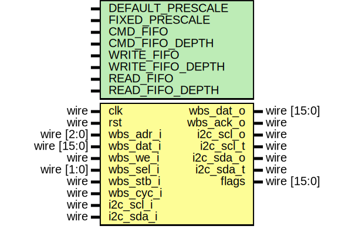

# EF_I2C

I2C master controller with an APB interface
## The wrapped IP


 The IP comes with an APB Wrapper.

### Wrapped IP System Integration

```verilog
EF_I2C_APB INST (
        `TB_APB_SLAVE_CONN,
        .scl_i(scl_i),
        .scl_o(scl_o),
        .scl_oen_o(scl_oen_o),
        .sda_i(sda_i),
        .sda_o(sda_o),
        .sda_oen_o(sda_oen_o),
        .i2c_irq(i2c_irq)
);
```
> **_NOTE:_** `TB_APB_SLAVE_CONN is a convenient macro provided by [BusWrap](https://github.com/efabless/BusWrap/tree/main).

## Implementation example  

The following table is the result for implementing the EF_I2C IP with different wrappers using Sky130 PDK and [OpenLane2](https://github.com/efabless/openlane2) flow.
|Module | Number of cells | Max. freq |
|---|---|---|
|EF_I2C|TBD| TBD |
|EF_I2C_APB|TBD|TBD|
## The Programmer's Interface


### Registers

|Name|Offset|Reset Value|Access Mode|Description|
|---|---|---|---|---|
|Command|0004|0x00000000|w|bit 0-6: cmd_address, bit 8: cmd_start, bit 9: cmd_read, bit 10: cmd_write, bit 11: cmd_wr_m, bit 12: cmd_stop. Setting more than one command bit is allowed.  Start or repeated start will be issued first, followed by read or write, followed by stop.  Note that setting read and write at the same time is not allowed, this will result in the command being ignored.|
|Data|0008|0x00000000|w/r|bit 0-7: data, bit 8: data_valid, bit 9: data_last|
|PR|000c|0x00000000|w|prescaler = Fclk / (FI2Cclk * 4)|
|IM|0f00|0x00000000|w|Interrupt Mask Register; write 1/0 to enable/disable interrupts; check the interrupt flags table for more details|
|RIS|0f08|0x00000000|w|Raw Interrupt Status; reflects the current interrupts status;check the interrupt flags table for more details|
|MIS|0f04|0x00000000|w|Masked Interrupt Status; On a read, this register gives the current masked status value of the corresponding interrupt. A write has no effect; check the interrupt flags table for more details|
|IC|0f0c|0x00000000|w|Interrupt Clear Register; On a write of 1, the corresponding interrupt (both raw interrupt and masked interrupt, if enabled) is cleared; check the interrupt flags table for more details|

### Command Register [Offset: 0x4, mode: w]

bit 0-6: cmd_address, bit 8: cmd_start, bit 9: cmd_read, bit 10: cmd_write, bit 11: cmd_wr_m, bit 12: cmd_stop. Setting more than one command bit is allowed.  Start or repeated start will be issued first, followed by read or write, followed by stop.  Note that setting read and write at the same time is not allowed, this will result in the command being ignored.


|bit|field name|width|description|
|---|---|---|---|
|0|cmd_address|7|I2C address for command|
|8|cmd_start|1|set high to issue I2C start, write to push on command FIFO|
|9|cmd_read|1|set high to start read, write to push on command FIFO|
|10|cmd_write|1|set high to start write, write to push on command FIFO|
|11|cmd_write_multiple|1|set high to start block write, write to push on command FIFO|
|12|cmd_stop|1|set high to issue I2C stop, write to push on command FIFO|


### Data Register [Offset: 0x8, mode: w/r]

bit 0-7: data, bit 8: data_valid, bit 9: data_last


|bit|field name|width|description|
|---|---|---|---|
|0|data|8| I2C data, write to push on write data FIFO, read to pull from read data FIFO|
|8|data_valid|1|indicates valid read data, must be accessed with atomic 16 bit reads and writes|
|9|data_last|1|indicate last byte of block write (write_multiple), must be accessed with atomic 16 bit reads and writes|


### PR Register [Offset: 0xc, mode: w]

prescale = Fclk / (FI2Cclk * 4)


### Interrupt Flags

The wrapped IP provides four registers to deal with interrupts: IM, RIS, MIS and IC. These registers exist for all wrapper types generated by the [BusWrap](https://github.com/efabless/BusWrap/tree/main) `bus_wrap.py` utility. 

Each register has a group of bits for the interrupt sources/flags.
- `IM`: is used to enable/disable interrupt sources.

- `RIS`: has the current interrupt status (interrupt flags) whether they are enabled or disabled.

- `MIS`: is the result of masking (ANDing) RIS by IM.

- `IC`: is used to clear an interrupt flag.


The following are the bit definitions for the interrupt registers:

|Bit|Flag|Width|Description|
|---|---|---|---|
|0|BUSY|-1|High when module is performing an I2C operation|
|-1|BUSCONT|-1|High when module has control of active bus|
|-2|BUSACT|-1|High when bus is active|
|-3|MISS_ACK|-1|Slave ACK is missed|
|-4|CMDE|-1|Command FIFO is Empty|
|-5|CMDF|-1|Command FIFO is Full|
|-6|CMDOVF|-1|Command FIFO overflow; write 1 to clear|
|-7|WRE|-1|Write FIFO is Empty|
|-8|WRF|-1|Write FIFO is Full|
|-9|WROVF|-1|Write FIFO overflow; write 1 to clear|
|-10|RDE|-1|Read FIFO is Empty|
|-11|RDF|-1|Read FIFO is Full|

### The Interface 


#### Module Parameters 

|Parameter|Description|Default Value|
|---|---|---|
|DEFAULT_PRESCALE|Default value for Prescale; prescale = Fclk / (FI2Cclk * 4)|1|
|FIXED_PRESCALE|Prescale value is fixed or could be dynamically configured|0|
|CMD_FIFO|Command AXI4 FIFO enable|1|
|CMD_FIFO_DEPTH|Command AXI4 FIFO depth|32|
|WRITE_FIFO|Write AXI4 FIFO enable|1|
|WRITE_FIFO_DEPTH|Write AXI4 FIFO depth|32|
|READ_FIFO|Read AXI4 FIFO enable|1|
|READ_FIFO_DEPTH|Read AXI4 FIFO depth|32|

#### Ports 

|Port|Direction|Width|Description|
|---|---|---|---|
|scl_i|input|1|i2c scl (Serial Clock) input|
|scl_o|output|1|i2c scl (Serial Clock) output|
|scl_oen_o|output|1|i2c scl (Serial Clock) output enable|
|sda_i|input|1|i2c scl (Serial Data) input|
|sda_o|output|1|i2c scl (Serial Data) output|
|sda_oen_o|output|1|i2c scl (Serial Data) output enable|
|i2c_irq|output|1|i2c interrupt|
|wbs_adr_i|input|3|wishbone input address|
|wbs_dat_i|input|16|wishbone input data|
|wbs_dat_o|output|16|wishbone data out|
|wbs_we_i|input|1|wishbone write enable|
|wbs_sel_i|input|2|wishbone select|
|wbs_stb_i|input|1|wishbone chip select|
|wbs_ack_o|output|1|wishbone acknowledge|
|wbs_cyc_i|input|1|wishbone bus cycle|
|i2c_scl_i|input|1|i2c scl (Serial Clock) input|
|i2c_scl_o|output|1|i2c scl (Serial Clock) output|
|i2c_scl_t|output|1|i2c scl (Serial Clock) tristate|
|i2c_sda_i|input|1|i2c scl (Serial Data) input|
|i2c_sda_o|output|1|i2c scl (Serial Data) output|
|i2c_sda_t|output|1|i2c scl (Serial Data) tristate|
|flags|output|16|i2c flags|
## F/W Usage Guidelines:
1. Set the prescaler by writing to ``PR`` register where prescaler = clk_frq / (I2C_clk * 4)
2. Write a command in the ``command`` register according to whether you want to read or write as well as the slave address. 
3. Write the data in the ``data`` register if you are writing to slave or read the same register if you are reading from the slave. 
## Installation:
You can either clone repo or use [IPM](https://github.com/efabless/IPM) which is an open-source IPs Package Manager
* To clone repo:
```git clone https://https://github.com/efabless/EF_I2C```
* To download via IPM , follow installation guides [here](https://github.com/efabless/IPM/blob/main/README.md) then run 
```ipm install EF_I2C```
### Run cocotb UVM Testbench:
In IP directory run:
 ```shell
 cd verify/uvm-python/
 ```
 ##### To run testbench for design with APB 
 To run all tests:
 ```shell
 make run_all_tests BUS_TYPE=APB
 ```
 To run a certain test:
 ```shell
 make run_<test_name> BUS_TYPE=APB
 ```
 To run all tests with a tag: 
 ```shell
 make run_all_tests TAG=<new_tag> BUS_TYPE=APB
 ```